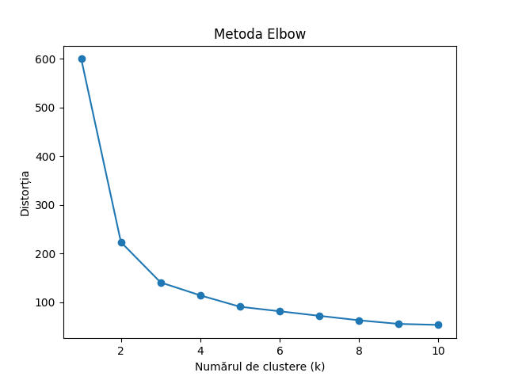
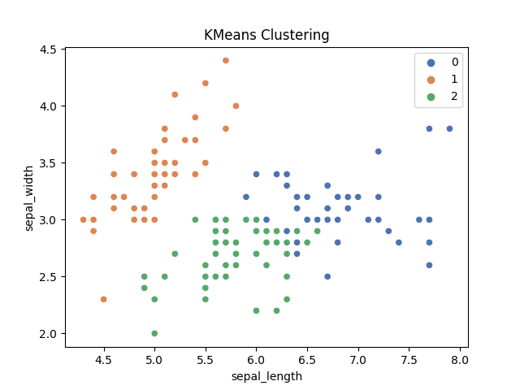
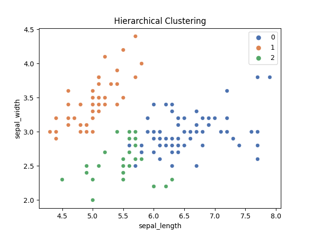
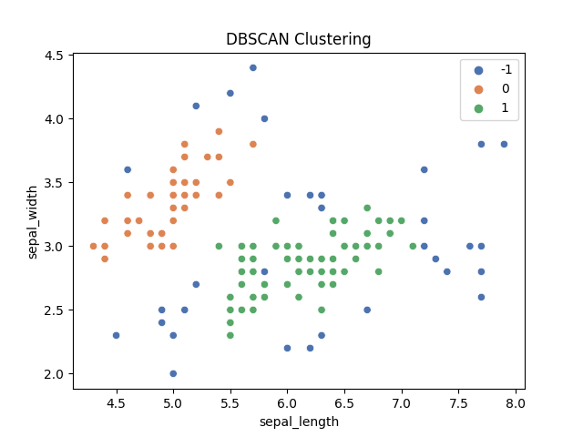

# Problemă de Clustering

Acest notebook prezintă o abordare a problemei de clustering folosind setul de date Iris.

## Capitolul 1: Descrierea teoretică a problemei și metodelor de clustering

Setul de date Iris este utilizat pentru a clasifica tipurile de flori Iris într-un număr de clustere. Se utilizează metode diferite de clustering, inclusiv k-Means, Ierarhic și DBSCAN. Se evaluează calitatea segmentării folosind Silhouette Score.

## Capitolul 2: Descrierea rezultatelor execuției itemilor 1-5

În această secțiune, am încărcat setul de date Iris, exclus coloana 'class', și am normalizat datele. Am utilizat metoda Elbow pentru a determina numărul optim de clustere. Am aplicat apoi trei metode de clustering diferite: k-Means, Ierarhic și DBSCAN. În final, am evaluat calitatea fiecărei metode de clustering folosind Silhouette Score.

- K-Means Silhouette Score: 0.4589717867018717
- Hierarchical Silhouette Score: 0.44553956399200406
- DBSCAN Silhouette Score: 0.6531989922140501

## Capitolul 3: Analiza generală a rezultatelor obținute

(DBSCAN a oferit cea mai bună performanță în termeni de scorul Silhouette, indicând o mai bună calitate a segmentării. Acest lucru sugerează că DBSCAN ar putea fi preferabil pentru acest set de date.)

# Rezultatele Clusterizării

K-Means Silhouette Score: 0.4589717867018717

Hierarchical Silhouette Score: 0.44553956399200406

DBSCAN Silhouette Score: 0.6531989922140501

