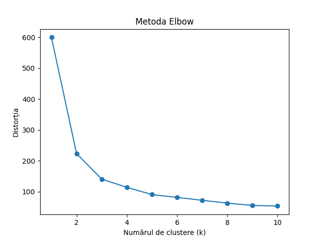

# Rezultatele Clusterizării

Metoda cotului este utilizată pentru a determina numărul optim de clustere pentru algoritmul K-Means. Graficul prezintă valorile de distorsiune pentru diferite numere de clustere. În acest caz, graficul indică faptul că distorsiunea scade rapid până la aproximativ 3 clustere și apoi se stabilizează. Prin urmare, sugerează că 3 clustere ar fi o alegere adecvată pentru algoritmul K-Means în această analiză.

K-Means Silhouette Score: 0.4589717867018717

Graficul de dispersie vizualizează clusterele formate de algoritmul K-Means. Fiecare punct de date este atribuit unuia dintre cele trei clustere pe baza similarității sale cu centroizii clusterelor. Scorul Silhouette Score de 0,459 sugerează un nivel moderat de calitate a clusterizării. Clusterele par a fi relativ bine separate în grafic, deși există o oarecare suprapunere între clusterele albastru și verde. În general, algoritmul K-Means reușește să grupeze punctele de date în clustere distincte, dar este posibil să existe o oarecare ambiguitate în separarea anumitor puncte de date.

Hierarchical Silhouette Score: 0.44553956399200406

Graficul de dispersie vizualizează clusterele formate de algoritmul de clasificare ierarhică. Similar cu K-Means, fiecare punct de date este atribuit unuia dintre cele trei clustere pe baza similarității. Scorul Silhouette Score de 0,446 indică un nivel moderat de calitate a clusterizării. Clusterele din grafic prezintă o anumită suprapunere, în special între clusterele verzi și albastre. Gruparea ierarhică surprinde structura ierarhică a datelor, dar este posibil să nu separe punctele de date la fel de distinct ca K-Means.

DBSCAN Silhouette Score: 0.6531989922140501

Graficul de dispersie vizualizează clusterele formate de algoritmul DBSCAN. Spre deosebire de K-Means și de gruparea ierarhică, DBSCAN nu necesită specificarea în prealabil a numărului de clustere. În schimb, acesta grupează punctele de date pe baza densității lor. Scorul Silhouette Score de 0,653 sugerează o calitate relativ mai bună a grupării în comparație cu ceilalți doi algoritmi. Algoritmul DBSCAN identifică cu succes regiunile dense și separă punctele de zgomot. Graficul arată clustere bine definite, în special clusterele albastru și verde, cu suprapunere minimă.
